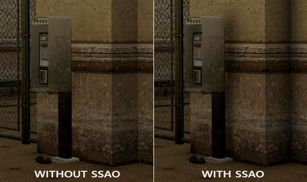
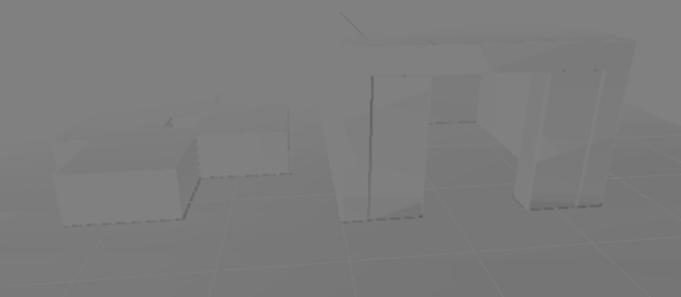
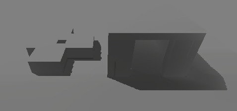
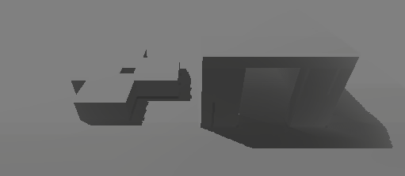

# Relatório Trabalho Final de Computação Gráfica

## Realizado por: Bernardo Barros a22401588 Simão Durão a22408594

## Introdução

Neste relatório descrevemos o trabalho realizado no âmbito da cadeira de Computação Gráfica no intiuto de implementar as técnicas de *Screen Space Ambient Occlusion* e *Screen Space Shadows*.

*Ambient Occlusion* é uma técnica em que certas zonas do mundo que, por exemplo cantos, são escurecidas devido à menor incidência de luz, tendo por base a posição da câmara. É obtida através do lançamento de raios de amostra que ao embaterem com geometria próxima iram indicar o certo de oclusão que depois é aplicado à superfície.

Por sua vez, *Screen Space Shadows* (*Contact Shadows*) é uma técnica de funcionamento semelhante ao *Ambient Occlusion*, porém aqui é tida em conta um ponto de luz direto e não um valor de luz ambiente.

**Sem *Contact Shadows* ativas.**

***Contact Shadows* ativas.**

Estas técnicas serão implementadas em Unity, mais precisamente em HLSL/ShaderLab.

---

## Implementação

O nosso objetivo seria implementar as técnicas de modo a que certas zonas sejam escurecidas através de *Screen Space Ambient Occlusion*, por exemplo as zonas em que as paredes interceptam com o chão e ao aplicar uma luz direta, possamos observar sombras como as quais obtidas através de Screen Space Shadows.

Para implementar *Screen Space Ambient Occlusion*, nós temos de responder a uma questão, o quão ocluído um ponto no espaço está, tendo em conta a posição da câmara. Quanto mais ocludido pela geometria a seu redor um *pixel* estiver mais escuro estará.

### Screen Space Ambient Occlusion

No *frag* *shader* iremos fazer *sampling* that cor de todos os pixeis que aparecem no ecrâ e aplicar um *Ambient Occlusion Factor* ao seu valor de cor. Quanto menor for o valor do *aoFactor* mais escuro irá ficar o pixel.

Definimos a função *ComputeAO* para calcular o valor do fator de *Ambient Occlusion* tendo por base as coordenadas *UV* do *pixel* que iremos usar para descubrir as coordenadas de *View Space* e as normais do *pixel* o que nos permite saber a posição do pixel e a direção a que está virada a superfície em que está.

Para descobrir as coordenadas de *View Space* e as normais do *pixel* definimos as funções *GetLinearDepth*, *ReconstructViewPosition* e *GetNormal*.

Em *ReconstructViewPosition*, que irá receber os valores de *UV* do pixel, descobrimos primeiro o valor de profundidade não-linear, utilizando a função *SampleSceneDepth* disponibilizada pelo Unity que retorna a *rawDepth* que é um valor armazenado em *Projection Space* limitado entre 0 e 1 apenas indicando se está perto ou longe da câmara.
Apartir dos valores de *UV* e *rawDepth* obtidos, iremos usar a função do Unity *ComputeWorldSpacePosition* que irá retornar as coordenadas em *World Space* do *pixel*. A função irá primeiro obter a posição em *Clip Space* do pixel utilizando os *UVs* e o *rawDepth* do pixel e depois multiplicando pela *Inverse View-Projection Matrix*, que indica a posição em *World Space* de um pixel no ecrã e depois de ajustar as coordenadas baseadas na distância (*perspective divide*), obtemos a posição em *World Space* do *pixel*.
Ao obter este valor, multiplicamos pela Matriz de *View* que nos dará as coordenadas em *View Space* do pixel. Resumindo, a função irá retornar a posição 3D relativamente à câmara.

Para obtermos o valor da normal do *pixel* usamos a função *GetNormal*, que primeiro irá fazer *sample* das *Normal Textures* da cena que retorna uma textura com as normais do *pixel*. Esta textura armazena os valores em valores RGB que estão entre 0 e 1, usando a função do *Unity* *UnpackNormal* que recebe a textura, convertemos os valores para estarem -1 e 1. No final normalizamos o valor da normal, para assegurar que se mantém como vetor unitário e retornamos o valor em coordenadas *View Space*.

Agora que temos a posição em *View Space* do pixel e a direção da superfície em que está, podemos passar a gerar as *samples* para testar se o *pixel* está a ser ocluído pela geometria em redor. Iremos definir um hemísfero em que serão feitas as *samples*.

Primeiro temos de considerar duas questões, primeiro o hemisfério tem de estar orientado para a normal do pixel e segundo temos de rodar o hemisfério de *samples* para cada pixel de modo a evitar a formação de padrões.
Para rodar o hemisfério, definimos um vetor com valores de X e Y aleatórios com base nos valores de *UV* do pixel. Com este vetor aleatório iremos definir uma Matriz de Tangente, Bitangente e Normal que irá rodar o hemisfério para cada pixel e alinhar à normal do mesmo. Para descobrir o valor da tangente, descobrimos a parte do vetor que está alinhado com a normal e subtraímos essa parte ao mesmo obtendo a tangente à normal. Para obtermos a Bitangente apenas temos de fazer o produto vetorial da tangente e a normal, obtendo um vetor que será perpendicular a ambos.

Com a matriz definida, declaramos uma variável *occlusion* que irá acumular o valor de oclusão do *pixel* e definimos também uma variável bias que será usada no teste de oclusão para prevenir que superfícies sejam consideradas ocludidas devido a erros de imprecisão, ou seja, é uma margem de erro.

Definimos depois o ciclo de iteração, com o número de iterações a ser igual ao número de *samples* que usamos (por definição 32 *samples*).
A cada iteração geramos uma *sample* na forma de um vetor unitário de direção, com valores de X e Y comprimidos entre -1 e 1 e valores de Z entre 0 a 1, pois apenas queremos fazer *sampling* acima da superfície do pixel (iremos fazer o módulo de Z para assegurar que é positivo) e finalmente multiplicamos esta direção com a Matriz Tangente, Bitangente e Normal para alinhar com a normal e para esta direção ser rodada para cada pixel.
Para evitar que *samples* que estão demasiado próximas à superfície sejam consideradas como ocludidas definimos a variável *NdotS* que será igual ao produto interno da normal e a direção da *sample*. Se a direção da *sample* estiver demasiado afastada da direção da normal então a sample é saltada.

Definimos uma variável *scale* que irá fazer com que a maior parte das samples sejam geradas perto do *pixel*, com estas a serem criadas nas primeiras iterações. Isto é feito pois a geometria perto do pixel terá um maior efeito no fator de oclusão.
Com a variável *scale* geramos as posições das *samples* somando o vetor de direção e multiplicando com uma certa distância obtida com multiplicação do limite em que as samples são geradas e a variável *scale*.

Com a posição da *sample* obtida teremos de descobrir os valores UV da posição para podermos fazer o teste de oclusão. Primeiro convertemos a posição para *Clip Space* multiplicando as coordenadas de *View Space* pela matriz de projeção. Depois dividimos as coordenadas da *clipPosition* de X e Y por W para obtermos as *Normalized Device Coordinates* e finalmente convertemos para coordenadas UV. Em *Unity* as coordenadas *UV* são viradas verticalmente em *Clip Space* pelo que temos de virar novamente para corrigir, obtendo os *UVs* corretos da posição da *sample*. Com estes *UVs* sabemos que *pixel* a que corresponde este ponto de amostra e verificamos se a sample encontra-se no ecrã, ignorando a sample se for o caso.

Apartir dos *UVs* da *sample* obtemos a profundidade da geometria que está presente no ecrã e apartir das coordenadas negativas de posição da *sample*, pois a cãmara visualiza a cena por valores negativos de Z, obtemos a profundidade a que a *sample* point está da câmara. Com estes dois valores obtemos um valor de distância que iremos usar para determinar o quanto a geometria afeta o valor de oclusão.

Finalmente chegamos ao teste de oclusão, em que, se o valor da profundidade da geomtria da cena for menor que o valor da profundidade da sample então significa que algo está a bloquear essa direção contribuindo para a oclusão.

Após concluir a iteração fazemos a média para obter o valor de oclusão do pixel e asseguramos que esse valor está entre 0 e 1.

Adicionámos também forma para remover o efeito para objetos que estão muito longe da câmara e variáveis para aprefeiçoar o efeito.

O resultado do shader é que as zonas que estarão a ser ocludidas estão cobertas por pontos pretos (o *noise*) pois o efeito é inconsistente, enquanto um pixel pode estar ocludido o pixel a seguir pode não estar. O SSAO é um efeito que na sua base só dá uma estimativa do que poderá estar a ocludir um pixel, sendo necessário implementar várias maneiras de reduzir as imperfeições do efeito.
Entre as maneiras que teriamos de melhorar o efeito visual do SSAO, podiamos criar um efeito *Blur* que iria fazer a média entre os pixeis para igualar os valores de oclusão removendo assim o noise.

### Screen Space Shadows (Contact Shadows)

Para a implementação da técnica de *Screen Space Shadows* (SSS), partimos com o objetivo de simular o bloqueio da luz direta pelas paredes. Queríamos garantir que ao projetar uma luz direcional nas paredes, as paredes projetassem umas sombras apenas a usar informação disponível no ecrã.

Para isso, utilizo uma técnica de *Ray Marching* na *View Space*. Basicamente, ao usar a posição de um pixel, fazemos *steps* de um *ray* para a luz principal do cenário. A cada *step*, ele vai verificar se o *ray* colide com algum objeto presente no Depth Buffer.

No inicio, a reconstrução das posições do pixeis no mundo 3D é essencial. Ao usar GetWorldPos, a função recebe as coordenadas UV e a *raw depth*, essas duas variaveis são obtidas SampleSceneDepth que permite fazer isso.

GetWorldPos recorre a ComputeWorldSpacePosition, isso faz a transformação inversa de matriz da projeção da *View*. Faz com que possamos calcular o *pixel* em *World Space*. Para o Contact Shadows funcionar, o vetor crucial _MainLightPosition, ele dá a direção da luz e depois ela é normalizada.

Antes disso, inicializamos a variável *rayPos* com a posição em *World Space* calculada. A esta posição inicial, aplicamos uma correção na direção da luz multiplicado pelo _Bias. Para evitar o *shadow acne*, impedindo que o raio colidir imediatamente com a própria superfície de onde partiu.

Entramos no ciclo, que concretiza o *Ray Marching*. O número máximo de iterações é limitado pela variável _MaxSteps, impedindo que o shader fique as voltas.

A cada iteração, avançamos a posição do raio (graças ao *step*) na direção da luz, que percorre uma distância definida pela variável _Step. O raio move-se em coordenadas de mundo 3D, mas a informação de oclusão está numa textura 2D (Depth Buffer).

Para resolver, temos de projetar a posição atual do raio de volta para o espaço de ecrã a cada passo. Multiplicamos a posição do raio pela *GetWorldToHClipMatrix* para ter a posição em *Clip Space* , convertemos para coordenadas normalizadas, e, depois transformamos em coordenadas UV. Se os UVs saírem do ecrã (0 a 1), interrompemos o ciclo.

Com as coordenadas UV da posição atual do raio, fazemos o *sampling* da profundidade da cena (*SampleSceneDepth*). Para realizar uma comparação válida, convertemos a profundidade amostrada para *Linear Eye Depth*. Depois, transformamos a posição do raio de *World Space* para *View Space* para dar a profundidade linear (rayLin).

O teste de sombra é feito com a diferença (diff) entre a profundidade do raio e a profundidade da *sample*. Se *diff* for maior que um valor mínimo e menor que a *_Thickness* definida, consideramos que houve uma interseção. A variável *_Thickness* define a "espessura" dos objetos, isso evita que superfícies distantes no fundo sejam consideradas como oclusão do raio.

Caso uma interseção é detetada, a sombra fica como 1.0. Para melhorar a estética, aplicamos um *Edge Fade* e diminuimos a sombra com base na distância percorrida pelo raio. O resultado é a cor do *pixel* escurecida pela sombra multiplicado pela *_Strength*.

Encontra-mos também exemplos de SSS,

## Conclusão

Em suma, obtemos um algoritmo básico que permite calcular os valores de ocultação numa cena resultando em pixeis que sejam considerados ocultados recebam um efeito de escurecimento sendo necessário implementar um *shader* de *Blur* para melhorar o efeito visual. Por sua vez, obtemos um efeito de *Screen Space Shadows* em que estas são feitas na cena apenas com a informação do ecrã.

## Referências

[Epic Games explain Contact Shadows in Unreal Engine](https://dev.epicgames.com/documentation/en-us/unreal-engine/contact-shadows-in-unreal-engine)

[https://github.com/Baksonator/ssao](https://github.com/Baksonator/ssao)

[https://gist.github.com/transitive-bullshit/6770363](https://gist.github.com/transitive-bullshit/6770363)

[https://github.com/lettier/3d-game-shaders-for-beginners/blob/master/sections/ssao.md](https://github.com/lettier/3d-game-shaders-for-beginners/blob/master/sections/ssao.md)

[Image of SSAO](https://bobby-parker.com/architectural-rendering-blog/all-you-need-to-know-about-ambient-occlusion)

[Image of SSAO](https://www.sciencedirect.com/topics/computer-science/ambient-occlusion)

[Preview de SSS](https://www.shadertoy.com/view/mtXfDf)

[Articulo sobre SSS](https://panoskarabelas.com/posts/screen_space_shadows/)

[Depth](https://learnopengl.com/Advanced-OpenGL/Depth-testing)

[Comparison of SSS](https://blenderartists.org/t/how-to-disable-contact-shadows-for-object/1403230)

[Github de um SSS em Unity](https://github.com/keijiro/ContactShadows/tree/master/Assets/ContactShadows)

[Unity Contact Shadows API](https://docs.unity3d.com/Packages/com.unity.render-pipelines.high-definition@14.0/manual/Override-Contact-Shadows.html)

[Efficient GPU Screen-Space Ray Tracing](https://jcgt.org/published/0003/04/04/)

[Ray Marching Wikipedia](https://en.wikipedia.org/wiki/Ray_marching)

[Morgan McGuire on Graphics & Games - Screen Space Ray Tracing](https://casual-effects.blogspot.com/2014/08/screen-space-ray-tracing.html)

[Unity Forum sobre SSAO e Ray marching](https://discussions.unity.com/t/ray-marching-screen-space-ambient-occlusion/745620)

[Video sobre Ray marching](https://www.youtube.com/watch?v=khblXafu7iA&t=172s)

[SSS em URP](https://docs.unity3d.com/6000.3/Documentation/Manual/urp/renderer-feature-screen-space-shadows.html)