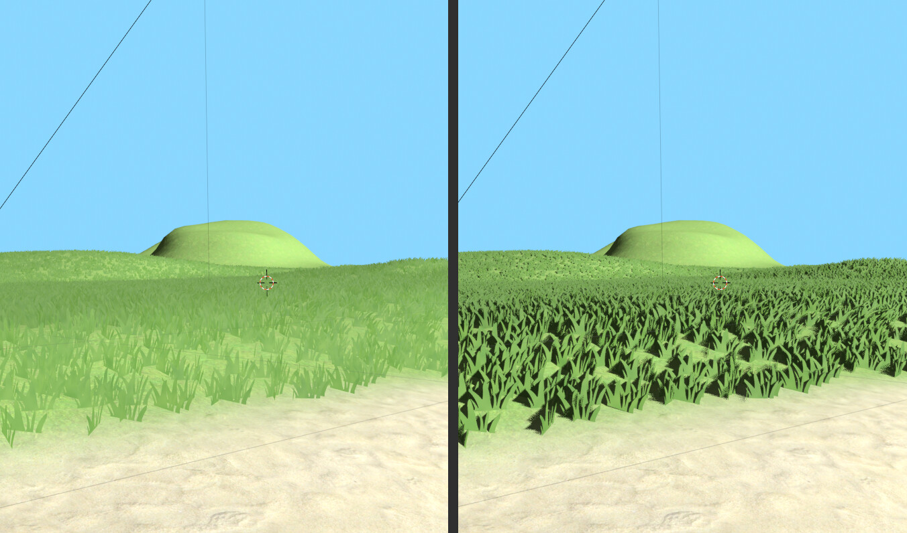
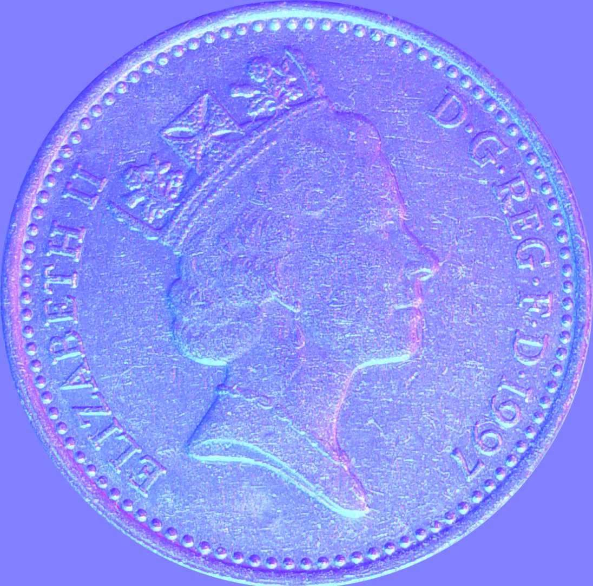
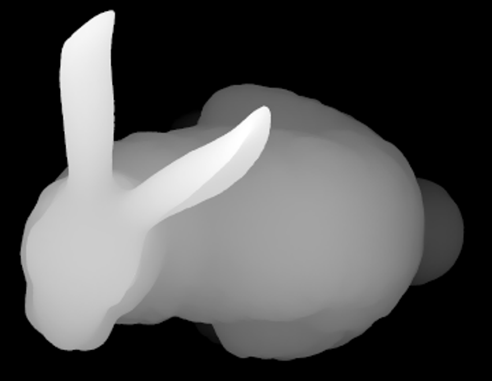
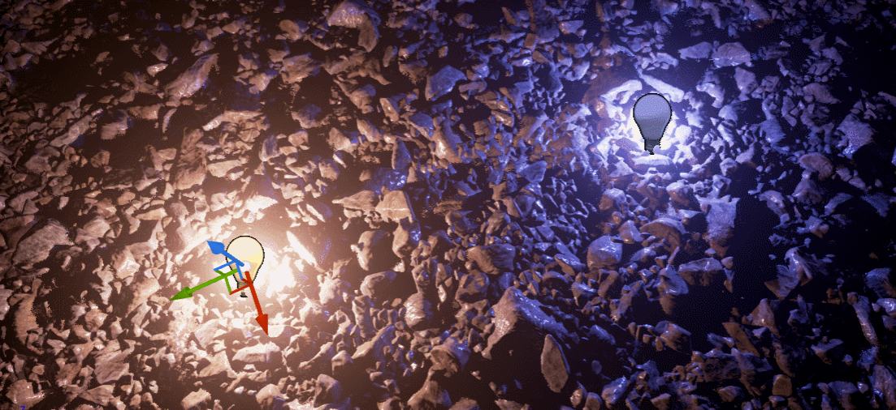
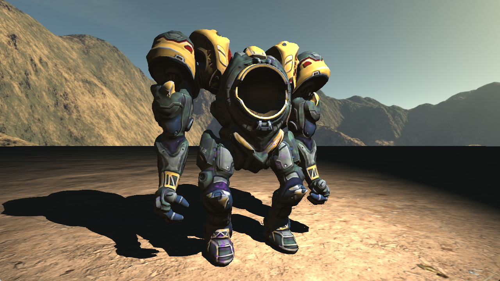
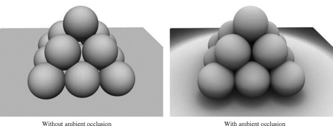

# Relatório Trabalho Final de Computação Gráfica
### Realizado por: Bernardo Barros a22401588 Simão Durão a22408594

## Introdução

Neste relatório descrevemos o trabalho realizado no âmbito da cadeira de Computação Gráfica no intiuto de implementar as técnicas de Ambient Occlusion e Screen Space Shadows.

Ambient Occlusion é uma técnica em que certas zonas do mundo que, por exemplo cantos, são escurecidas devido à menor incidência de luz. É obtida através do lançamento de raios de amostra que ao embaterem com geometria próxima iram indicar o certo de oclusão que depois é aplicado à superfície.

Por sua vez, Screen Space Shadows (Contact Shadows) é uma técnica de funcionamento semelhante ao Ambient Occlusion, porém aqui é tida em conta um ponto de luz direto e não um valor de luz ambiente.

Estas técnicas serão implementadas em Unity, mais precisamente em HLSL/ShaderLab.

---
## Implementação

O nosso objetivo seria implementar as técnicas de modo a que certas zonas sejam escurecidas através AO, por exemplo as zonas em que as paredes interceptam com o chão e ao aplicar uma luz direta, possamos observar sombras como as quais obtidas através de Screen Space Shadows.

Esta imagem é a representação de um debug normal Shader utilizado para SSAO.

Para a implementação da técnica de Screen Space Shadows (SSS), partimos com o objetivo de simular o bloqueio da luz direta pelas paredes. Queríamos garantir que ao projetar uma luz direcional nas paredes, as paredes projetassem umas sombras.

Na nossa primeira tentativa, Inspiramo-nos a implementação de SSS do proprio Unity que tem a opção de criar Contact Shadows. Conseguimos perceber, o que eram e qual era a meta final que queriamos obter para a implementação do nosso proprio shader de Contact Shadows.

Na segunda, criamos o shader e o material para SSS, no inicio, estavamos bastante confusos porque implementamos o shader e ficou simplesmente cinzento não havia luz nem sombra, mas SSS precisa de saber onde está a directional light e que pixeis estão bloqueados da luz.

Na terceira acabamos por descobrir o que era Raymarching e que é essencial para SSS. Isso permite de enviar raios da posição do pixel para a luz e se houver pixeis que bloqueiam esse raio esse pixel será um *shadow pixel*. No shader usa um Depth buffer já que ele não tem acesso á cena em 3D. Por isso, ele recontroi os pixeis da que aparecem na camara para 3D assim pode ver se a luz foi obstruida por um pixel.

Esta imagem seria a representação de um Depth Map para SSS.

A partir dessa ultima tentativa, a implementação de Contact Shadow foi fluida, ao criar um script para o shader saber onde está a camâra e a directional light. Esse script cria uma matriz que manda para o shader a direção da luz e como ele deveria agir sobre isso.

Encontra-mos também exemplos de SSAO e SSS,

### Screen Space Shadows

### Screen Space Ambient Occlusion

## Conclusão

## Referências

[Epic Games explain Contact Shadows in Unreal Engine](https://dev.epicgames.com/documentation/en-us/unreal-engine/contact-shadows-in-unreal-engine)

[https://github.com/Baksonator/ssao](https://github.com/Baksonator/ssao)

[https://gist.github.com/transitive-bullshit/6770363](https://gist.github.com/transitive-bullshit/6770363)

[https://github.com/lettier/3d-game-shaders-for-beginners/blob/master/sections/ssao.md](https://github.com/lettier/3d-game-shaders-for-beginners/blob/master/sections/ssao.md)

[Image of SSAO](https://bobby-parker.com/architectural-rendering-blog/all-you-need-to-know-about-ambient-occlusion)

[Image of SSAO](https://www.sciencedirect.com/topics/computer-science/ambient-occlusion)

[Preview de SSS](https://www.shadertoy.com/view/mtXfDf)

[Articulo sobre SSS](https://panoskarabelas.com/posts/screen_space_shadows/)

[Depth](https://learnopengl.com/Advanced-OpenGL/Depth-testing)

[Comparison of SSS](https://blenderartists.org/t/how-to-disable-contact-shadows-for-object/1403230)

[Github de um SSS em Unity](https://github.com/keijiro/ContactShadows/tree/master/Assets/ContactShadows)

[Unity Contact Shadows API](https://docs.unity3d.com/Packages/com.unity.render-pipelines.high-definition@14.0/manual/Override-Contact-Shadows.html)

[Efficient GPU Screen-Space Ray Tracing](https://jcgt.org/published/0003/04/04/)

[Ray Marching Wikipedia](https://en.wikipedia.org/wiki/Ray_marching)

[Morgan McGuire on Graphics & Games - Screen Space Ray Tracing](https://casual-effects.blogspot.com/2014/08/screen-space-ray-tracing.html)

[Unity Forum sobre SSAO e Ray marching](https://discussions.unity.com/t/ray-marching-screen-space-ambient-occlusion/745620)

[Video sobre Ray marching](https://www.youtube.com/watch?v=khblXafu7iA&t=172s)

[SSS em URP](https://docs.unity3d.com/6000.3/Documentation/Manual/urp/renderer-feature-screen-space-shadows.html)